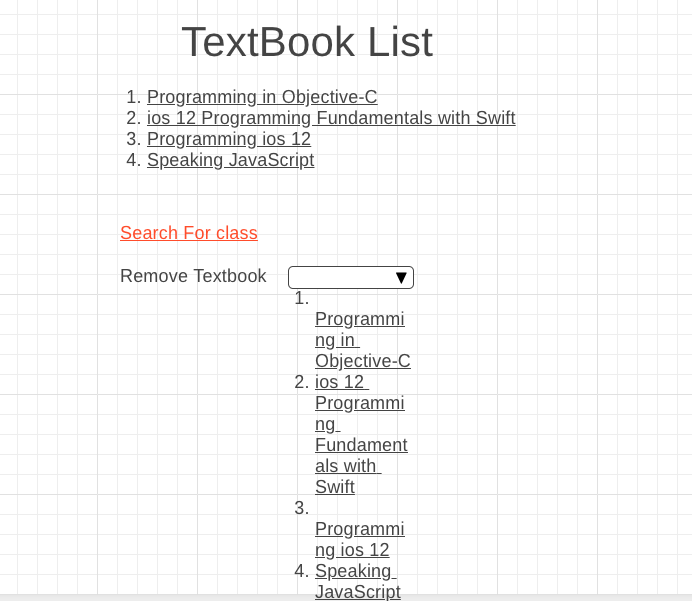
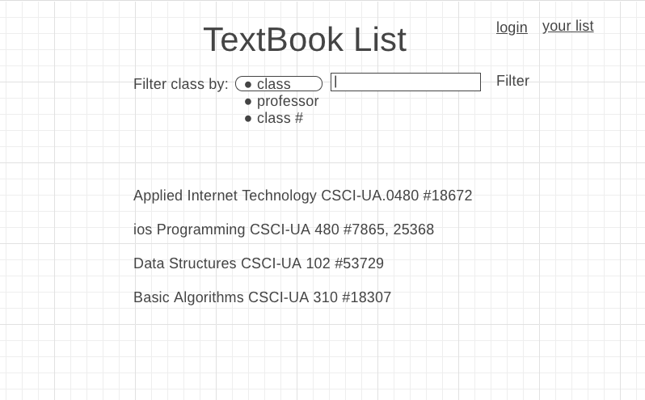
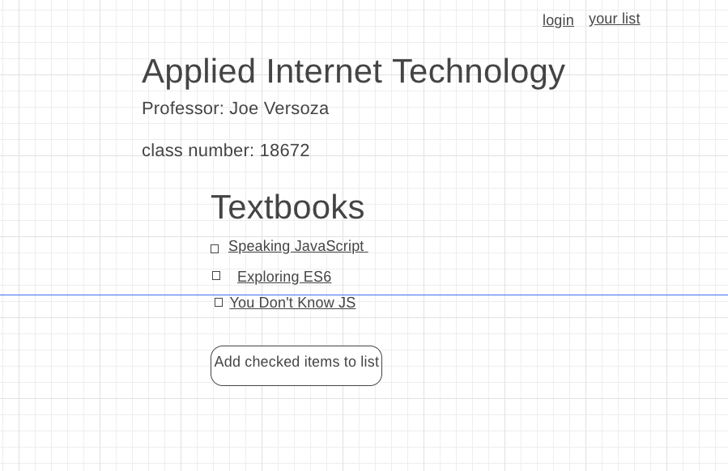
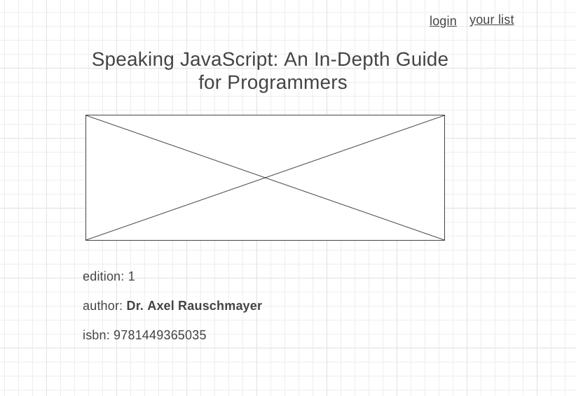
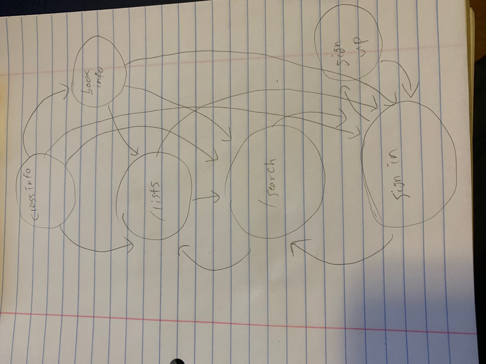

# Semester Preparer

## Overview

Getting ready for the semester is really hard, especially when you need to figure out all the textbooks you need to buy. Going from one syllabus to another and going into the class website to find the name, isbn, or author of the textbook. 

Semester Preparer is a web app that will allow users to search either their class through name or class number and through their professor's name; through this search users will find and add their textbooks into a list.

## Data Model

The application will store Classes, Lists and TextBooks

* users can each have a list with multiple textbooks (by reference)
* each Claasses will have multiple TextBooks (by embedding)

(___TODO__: sample documents_)

An Example Class:

```javascript
{
  name: "ios Programming",
  Professor: "Nathan Hull",
  class number: [7865,25368],
  textbook: [
  {name: "Programming in Objective-C"
  edition: 6,
  author: "stephen G. Kochan",
  isbn: 9780321967602},
  {name: Programming ios 12,
  edition 1,
  author: MAtt Neuburg,
  isbn:1492044636}
  ]
}
```

An Example TextBook
```javascript
{
title: "Programming in Objective-C"
edition: 6,
author: "stephen G. Kochan",
isbn: 9780321967602
}
```
An Example User:
```javascript
{
username: "dhk371@nyu.edu",
password: //password user set
lists: // an array of references to TextBook
}
```

## [Link to Commented First Draft Schema](db.js) 

(___TODO__: create a first draft of your Schemas in db.js and link to it_)

## Wireframes


/list - shows user list of textbook they need for their classes




/search - page with list of all nyu classes where a student can search for the class  he/she is taking 



/classinfo/slug - page for showing information about specific class



/bookinfo/slug - page for showing information about specific book




## Site map




## User Stories or Use Cases


1. as non-registered user, I can register a new account with the site
2. as a user, I can log in to the site
3. as a user, I can create a textBook list
4. as a user, I can view all the textbooks I've added from classinfo page in a list
5. as a user, I can add textbooks from the classinfo page
6. as a user, I can access the classinfo 

## Research Topics


* (5 points) Integrate user authentication
    * passport for user authentication
    * student's own list of textbook will be private and only accessible to the authenticated student. Non autthenticated will show only a blank list
* (3 points) use css framework
    * gonna be working with Bootstrap
    * log in page, navbar, and responsive page 


## [Link to Initial Main Project File](app.js) 

(___TODO__: create a skeleton Express application with a package.json, app.js, views folder, etc. ... and link to your initial app.js_)

## Annotations / References Used

(___TODO__: list any tutorials/references/etc. that you've based your code off of_)


